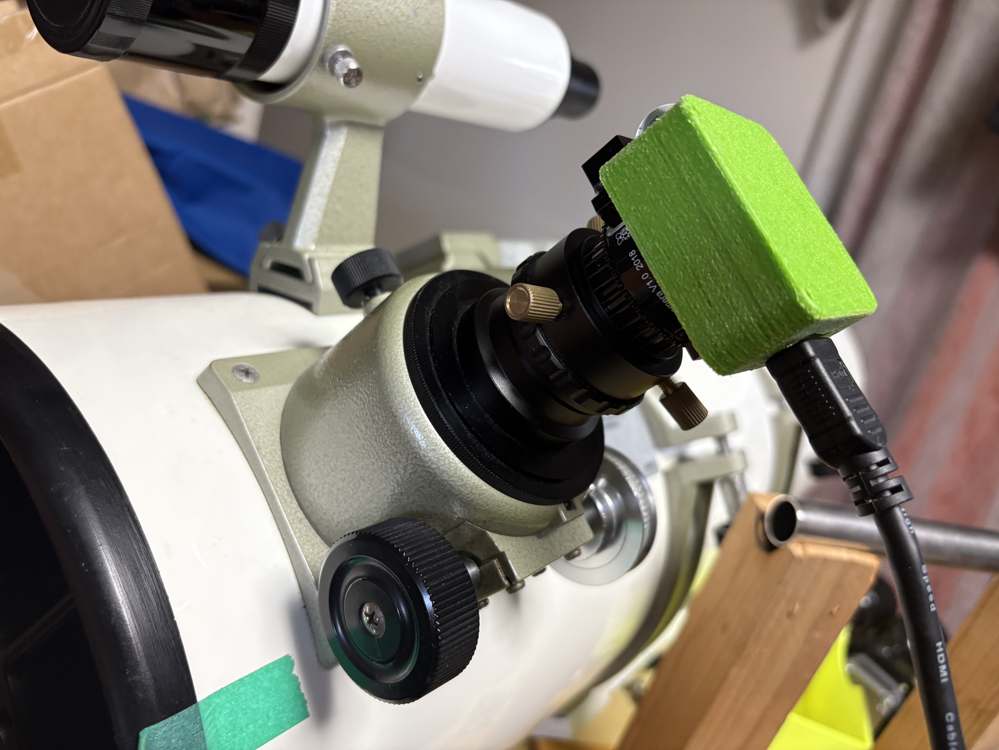
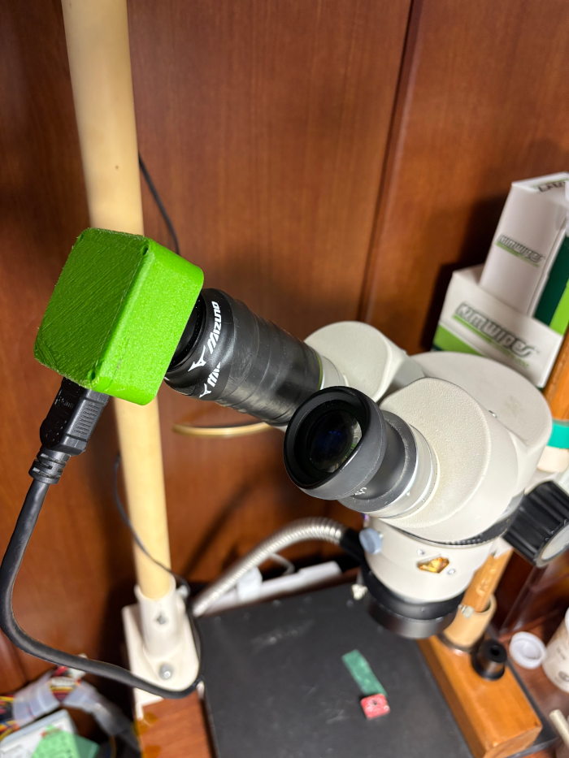
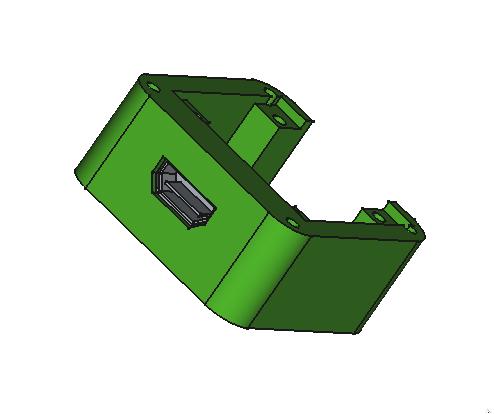
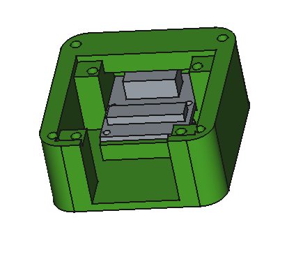
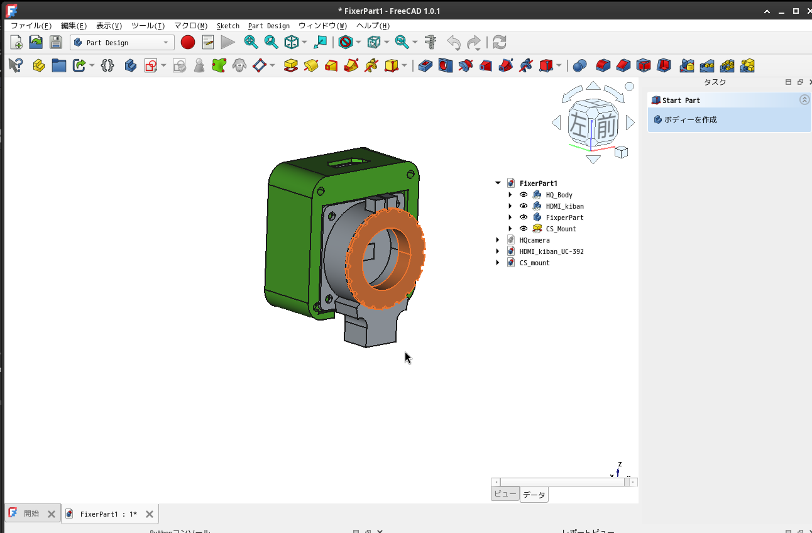
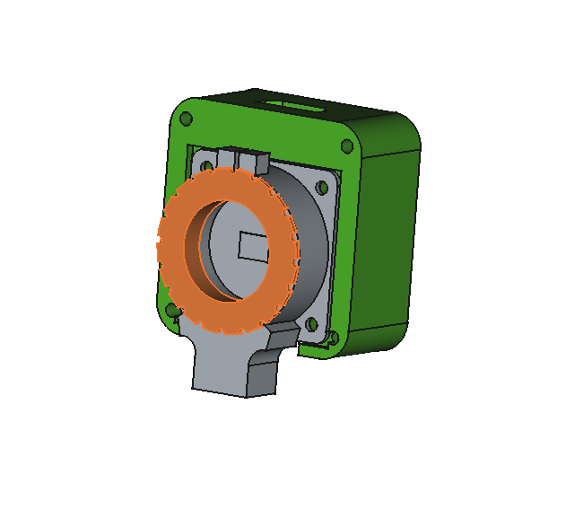

# HQ Camera Adapter Case for Raspberry Pi (FreeCAD Model)

## Overview

This project provides a FreeCAD model for a custom case designed to house a Raspberry Pi HQ Camera (IMX477) and a CSI-to-HDMI adapter board (Arducam CSI-HDMI, available [here](https://www.amazon.co.jp/dp/B06XDNBM63?ref=ppx_yo2ov_dt_b_fed_asin_title&th=1)). The case is intended for use with Newtonian reflector telescopes, specifically the Vixen R200SS, and allows for a neat integration of the camera and HDMI adapter.

## Motivation

When connecting the Raspberry Pi HQ Camera to a Raspberry Pi 4 via a ribbon cable, the setup can become unwieldy, especially when used with a telescope. To improve cable management and protect the components, this case was designed to enclose both the HQ Camera and the HDMI adapter board, enabling a more robust and tidy connection using an HDMI cable.

## Features

- Designed in FreeCAD
- Accommodates the Raspberry Pi HQ Camera (IMX477)
- Fits the Arducam CSI-to-HDMI adapter board
- Suitable for mounting on the Vixen R200SS telescope or the other microcope
- STL file for 3D printing included (`FixerPart1.stl`)

## Files

- `FixerPart1.stl`: 3D printable STL file of the case
- `FixerPart1.FCStd`: FreeCAD source file
- `Assemble.FCStd`, `CS_mount.FCStd`, etc.: Additional FreeCAD files for assembly and mounting

## Example Setup

Below is a photo of the assembled case attached to the telescope. The green printed part is the custom case housing the HQ Camera and HDMI adapter.

This photo shows an example of the adapter case attached to a microscope. 

## FreeCAD Model Samples

Below are sample images exported from FreeCAD, showing the design and assembly of the adapter case:

| Front View | Upper View | Oblique View | Assembly Example |
|:----------:|:----------:|:------------:|:----------------:|
|  |  |  |  |

## How to Use

1. Print `FixerPart1.stl` using a 3D printer.
2. Assemble the Raspberry Pi HQ Camera and the Arducam CSI-HDMI adapter inside the printed case.
3. Mount the case onto the telescope (e.g., Vixen R200SS) or the other microsope.
4. Connect the HDMI cable between the adapter and the Raspberry Pi 4.

## License

This project is released under the MIT License.